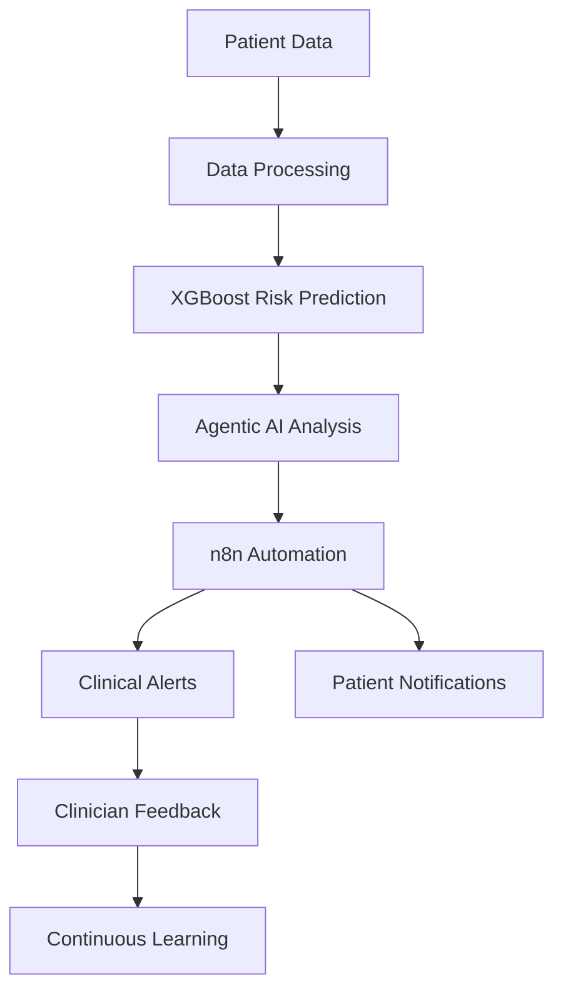

# 🤖 Agentic AI & n8n Automation Powered Maternal Care Framework


## 🩺 Overview

An intelligent maternal healthcare monitoring framework that combines **Agentic AI**, **Machine Learning**, and **n8n Workflow Automation** to provide continuous pregnancy monitoring, predictive risk assessment, automated clinical triage, and personalized healthcare recommendations.

Traditional maternal care relies on periodic clinical visits, which may fail to detect rapidly developing complications such as **Preeclampsia** and **Gestational Diabetes**. This framework bridges that gap through continuous monitoring, intelligent reasoning, and automated intervention workflows.

---

## 🎯 Project Goals

✅ Continuous Maternal Health Monitoring

✅ Early Detection of Pregnancy Complications

✅ Predictive Risk Assessment Using Machine Learning

✅ AI-Powered Clinical Decision Support

✅ Automated Workflow Orchestration with n8n

✅ Context-Aware Alert Generation

✅ Continuous Learning Through Expert Feedback

---

## 🚨 Problems Addressed

### 📊 Data Fragmentation

Patient information is often distributed across multiple systems such as EHRs, wearable devices, and patient-reported logs.

### 🔔 Alert Fatigue

Static threshold-based systems generate excessive false alarms, reducing clinician trust.

### ⏳ Delayed Intervention

Traditional monitoring may miss subtle warning signs that develop between scheduled clinical visits.

### 🧠 Lack of Contextual Intelligence

Conventional monitoring systems analyze numbers but fail to understand symptom context.

---

## ✨ Key Features

### 📈 Predictive Risk Analytics

* XGBoost-based risk prediction model
* Early identification of:

  * Preeclampsia
  * Gestational Hypertension
  * Gestational Diabetes
  * Macrosomia Risk

### 🤖 Agentic AI Clinical Reasoning

* Context-aware risk interpretation
* Explainable clinical summaries
* Intelligent patient triage
* Personalized recommendations

### 🔄 n8n Workflow Automation

* Automated data collection
* Scheduled risk assessment
* Alert orchestration
* Multi-channel notifications

### 📱 Smart Alerting System

* Clinician emergency alerts
* Patient self-care notifications
* Risk-based alert prioritization

### 🔁 Continuous Learning

* Human-in-the-loop feedback
* Alert validation
* Dataset enrichment
* Future model retraining

---

## 🏗️ System Architecture

```text
┌─────────────────────┐
│  Patient Data Sources │
└──────────┬──────────┘
           │
           ▼
┌─────────────────────┐
│ Data Fusion Pipeline │
└──────────┬──────────┘
           │
           ▼
┌─────────────────────┐
│ XGBoost Risk Engine │
└──────────┬──────────┘
           │
           ▼
┌─────────────────────┐
│ Agentic AI Layer    │
│ (Gemini)            │
└──────────┬──────────┘
           │
           ▼
┌─────────────────────┐
│ n8n Workflow Engine │
└──────────┬──────────┘
           │
    ┌──────┴──────┐
    ▼             ▼
👨‍⚕️ Clinician   👩‍🍼 Patient
 Alerts         Coaching
```

---

## 🛠️ Technology Stack

| Category            | Technologies           |
| ------------------- | ---------------------- |
| 🤖 AI               | Gemini, Agentic AI     |
| 📈 Machine Learning | XGBoost                |
| 🔄 Automation       | n8n                    |
| 🌐 APIs             | REST APIs, Webhooks    |
| 🗄️ Data Sources    | EHR, IoT Devices, PROs |
| 📩 Notifications    | Email, SMS             |
| ☁️ Integration      | Cloud-Based Services   |

---

## 🔄 Workflow




---

## 📊 Expected Outcomes

🎯 Early Detection of Maternal Complications

🎯 Reduced Clinical Alert Fatigue

🎯 Improved Patient Safety

🎯 Faster Emergency Response

🎯 Enhanced Clinical Decision Support

🎯 Continuous System Improvement

---

## 🚀 Future Enhancements

* 📱 Mobile Application
* 🌍 Multi-language Support
* 🏥 FHIR & HL7 Integration
* 🔒 Federated Learning
* ⌚ Real-Time Wearable Integration
* 📊 Advanced Explainable AI Dashboards

---

## 👨‍💻 Author

**Subhash Thippa**
Integrated M.Tech Software Engineering
Vellore Institute of Technology (VIT), Chennai

---

## 📄 License

This project is developed for academic and research purposes and is intended for educational and non-commercial use.
